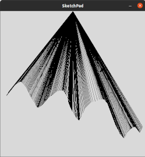

# Laboratorio 4
In questo laboratorio si continuano a studiare le interfacce grafiche, introducendo i canvas e ripassando i concetti del laboratorio precedente (widget, layout ed eventi.)

## Esercizio 1
Creare, tramite l'utilizzo di un canvas,
uno sketchpad (tipo *paint*) che permetta di disegnare tenendo premuto il mouse e trascinandolo.

Il disegno **NON** deve essere una linea che collega i punti percorsi dal mouse.
Invece, deve essere un insieme di linee, ciascuna che collega uno dei punti percorsi
dal mouse ad un punto all'orizzonte.
La posizione del punto all'orizzonte è scelta del programmatore. Esempio:

**Suggerimento**: l'evento che associato al trascinamento del mouse premuto è *\<B1-Motion\>*

## Esercizio 2
Creare un'interfaccia grafica che permetta a due utenti di sfidarsi in una partita a tris.

Differentemente dalla versione vista a lezione,
utilizzare un canvas per disegnare il tabellone di gioco.

**Suggerimento**: la logica dei callback rimane la stessa,
è necessario solamente cambiare a quali eventi vengono associati e modificare l'update e la creazione degli elementi grafici.

## Riferimenti
- [TkDocs tutorial](https://tkdocs.com/index.html)
- [Python Tk documentation](https://docs.python.org/3/library/tkinter.html) (no canvas)
- [John Shipman's Tk doc for ptyhon](https://tkdocs.com/shipman/intro.html) (vecchia ma con canvas)
