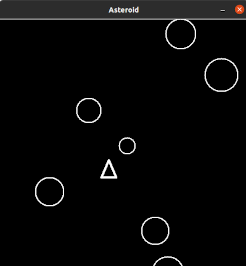

# Laboratorio 5
In questo laboratorio si introduce la programmazione a oggetti tramite la realizzazione di alcuni *class diagram*, una tipologia di diagrammi UML. L'obiettivo del laboratorio è imparare a "vedere" e rappresentare un problema in termini di classi.

Per disegnare i *class diagram* da pc si può utilizzare [PlantUML](https://plantuml.com/class-diagram),
tramite [l'editor online](https://www.plantuml.com/plantuml/uml/).

Infine, vi è un esercizio più complesso sulla realizzazione di un programma con interfaccia grafica.

## Esercizio 1
Progettare un *class diagram* per un software che gestisca le prenotazioni delle lezioni in presenza.

L'università offre diversi corsi, caratterizzati dal codice insegnamento, il nome e il numero di CFU. Un corso può essere seguito da uno o più studenti, caratterizzati dal proprio nome, numero matricola ed età. Uno studente può essere iscritto a un numero indefinito di corsi.
Il software deve permettere l'iscrizione degli studenti ai corsi e di ottenere la lista di corsi a cui uno studente è iscritto. Deve essere inoltre possibile ricavare la lista di studenti iscritti a un corso.

Un timeslot è univocamente definito dal numero dell'aula, orario d'inizio e orario di fine. Un corso può prenotare diversi timeslot, mentre un timeslot può essere prenotato al più da un corso. Uno studente può iscriversi ai timeslot dei corsi che segue.

Il software deve gestire la prenotazione dei timeslot da parte dei corsi e l'iscrizione degli studenti. Deve poter indicare all'utente a che corso un timeslot è associato e quanti studenti si sono iscritti per partecipare in presenza.

## Esercizio 2
Progettare un class diagram per un software che sia in grado di rappresentare il sistema fluviale di un territorio.

Gli elementi idrici che compongono un sistema fluviale sono identificati dal proprio nome e dalla propria portata.
Gli elementi idrici sono divisi in tre categorie: sorgenti, fiumi e foci.
Un fiume è caratterizzato dalla propria lunghezza e dalla lista di comuni che attraversa. Una sorgente è caratterizzata dal comune in cui si trova e dalla sua altezza sul livello del mare. Una foce, invece, è caratterizzata soltanto dal comune che la ospita.

Gli elementi idrici, possono avere uno o più affluenti.
Un elemento idrico può però essere affluente di al più un altro elemento idrico.
Le foci non possono essere affluenti, le sorgenti non hanno affluenti.

Un'agenzia ambientale è descritta dal proprio nome e dalla regione in cui opera.
Un'agenzia ambientale può prendere in carico un numero indefinito di elementi idrici,
mentre un elemento idrico può essere assegnato a solo un'agenzia ambientale.

Il software deve permettere di aggiungere affluenti ai diversi elementi idrici,
trovare gli affluenti di un elemento idrico, assegnare gli elementi idrici alle agenzie
e restituire tutti gli elementi idrici di cui un'agenzia si occupa.

## Esercizio 3
Creare un gioco simile ad [Asteroid](https://en.wikipedia.org/wiki/Asteroids_(video_game)).
Creare una navicella che possa muoversi nelle quattro direzioni e che l'utente possa comandare tramite le frecce della tastiera.

Creare delle asteroidi che si muovano verso il basso partendo dall'alto e che la navicella deve schivare.
Per ogni asteroide che esce dallo schermo in basso il punteggio dell'utente deve crescere.

Se la navicella colpisce un asteroide la partita si resetta.
Creare una logica per le collisioni semplice, anche se non verosimile data la forma degli oggetti.
Per esempio è possibile usare il metodo *find_overlapping* del canvas.

Migliorare il programma con funzionalità aggiuntive a piacere (salvataggio punteggio più alto, label con punteggio, ecc...)

